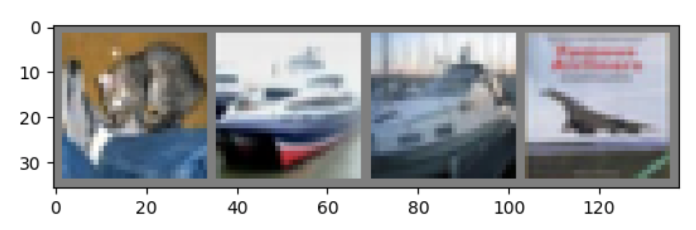

<!-- # Image Classification via CNN -->
This tutorial provides instruction on image classification using a convolutional neural network (CNN). It covers the creation, training, and evaluation of a CNN using PyTorch. Some parts of this tutorial are derived from the [Deep Learning with PyTorch: A 60 Minute Blitz](https://pytorch.org/tutorials/beginner/blitz/cifar10_tutorial.html#sphx-glr-beginner-blitz-cifar10-tutorial-py) tutorial.

# PyTorch Installation
PyTorch is an open-source machine learning library primarily used for computer vision and natural language processing applications. It is primarily developed by Facebook's AI Research lab. To install PyTorch, please use the following commands.

## Installation on macOS
Open your terminal and install PyTorch using the command:
```
$ conda install pytorch torchvision torchaudio -c pytorch
```
After installation, test your PyTorch version by running the following command:
```
$ python -c "import torch; print(torch.__version__)"
1.10.0
```

## Installation on Windows
To install PyTorch, please open your Anaconda prompt from the Start menu and use the following command:

```
(base) C:\Users\%USERNAME%> conda install pytorch torchvision torchaudio cpuonly -c pytorch
```
After installation, you can test it by checking the PyTorch version using the following command:
```
(base) C:\Users\%USERNAME%> python -c "import torch; print(torch.__version__)"
1.10.0
```

# Utilizing CIFAR10 Dataset
For this tutorial, we will be using the CIFAR10 dataset, which comprises 60,000 32x32 color images categorized into 10 classes, with 6,000 images per class. The dataset includes 50,000 training images and 10,000 test images. The images in CIFAR-10 are in the form of 3-channel color images, each 32x32 pixels in size. It's important to note that by convention, PyTorch places channels as the first dimension, which differs from other platforms such as Pillow, Matlab, and skimage wherein channels are positioned at the last dimension.

<center>

<p>Figure 1. CIFAR10 dataset</p>
</center>

We can load CIFAR10 from torchvision. It may take several minutes to download the dataset.
```python
from torchvision.datasets import CIFAR10
from torchvision.transforms import ToTensor

trainset = CIFAR10(root='./data', train=True,
                   download=True, transform=ToTensor())

testset = CIFAR10(root='./data', train=False,
                  download=True, transform=ToTensor())
```
The CIFAR10 dataset comprises two distinct parts: the training set and the test set. Generally, the model, is trained using the images from the training set and then evaluated using the test set.

- Training set: During the training phase, the CNN is presented with images from the training set and informed about their respective classes. This process facilitates the teaching of the CNN to differentiate between the various classes within the dataset.
- Testing set: Conversely, during the testing phase, the CNN is shown images from the test set and asked to classify them based on their respective classes. This allows for the evaluation of how effectively the CNN has learned to distinguish between the different classes in the dataset.

The variable `trainset.classes` contains all the class names in a specific order.
```python
trainset.classes
# ['airplane', 'automobile', 'bird', 'cat', 'deer', 'dog', 'frog', 'horse', 'ship', 'truck']
```
The training set comprises 50,000 images. Let's proceed to fetch the first image from the training set and display it.
```python
len(trainset)              # 50000 images
image, label = trainset[0] # get first image and its class id
image.shape                # 3 x 32 x 32
imshow(image)              # `imshow` is in cifar10.py
trainset.classes[label]    # 'frog'
```
The image has a shape of $3\times32\times32$, indicating that it consists of $3$ channels and $32\times32$ pixels.

The script `dataset.py` already contains all the necessary code for loading the dataset. In your program, all you need to do the following:
```python
from dataset import load_cifar10, imshow
trainset, testset = load_cifar10()
```
In addition to the dataset, we also require `DataLoader` objects to facilitate the random loading of image batches. A batch refers to a small collection of images. In this case, we've set the `batch_size` to 4, meaning each batch contains 4 images.

```python
from torch.utils.data import DataLoader
trainloader = DataLoader(trainset, batch_size=4, shuffle=True)
testloader = DataLoader(testset, batch_size=4, shuffle=False)
```
Then we may iterate over the `DataLoader`, to get batches until the dataset is exhausted.

```python
for batch in trainloader:
    images, labels = batch
    print(images.shape) # [4, 3, 32, 32]
    print(labels.shape) # [4]
    break
```
`images` is of shape `[4, 3, 32, 32]`, which means it contains 4 images, each has 3 channels, and is of size 32x32. `labels` contains 4 scalars, which are the class IDs of this batch.

# Constructing a CNN Model
In this tutorial, we are implementing the widely renowned simple CNN model, LeNet-5, which comprises 5 layers, encompassing both convolutional and fully-connected layers.

<center>

<p>Figure 2. Architecture of LeNet-5</p>
</center>

Indeed, a typical CNN architecture is composed of three main types of layers: convolutional layers, max pooling layers, and fully connected layers.

## Convolutional layers
Convolutional layers are typically the initial layers in a CNN. They perform convolutions on the input to extract features from the image. Each convolutional layer has the following architecture parameters:

- kernel_size $h\times w$: Specifies the dimensions of the convolutional kernel.
- in_channels: Denotes the number of input channels
- out_channels: Represents the number of output channels.

<center>

</center>

In this layer, along with the convolutional kernel $K$, a bias $b$ is incorporated into each output channel. The output can be expressed as
$$X' = K * X + b,$$
where $*$ signifies convolution, and $X$ and $X'$ correspond to the input and output. The total number of trainable parameters in a convolutional layer can be calculated using the formula:

$$\underbrace{h\times w \times \text{in\_channels}\times\text{out\_channels}}_\text{kernel}
+ \underbrace{\text{out\_channels}}_\text{bias}$$

By default, the convolution is performed without padding, resulting in a reduction in image size post convolution. If the input image size is $H\times W$ and the kernel size is $h\times w$, the output will have dimensions of
$$(H+1-h) \times (W+1-w).$$
Taking into account the channels and batch size, assuming the input tensor has the shape [batch_size, in_channels, H, W], the output tensor's dimensions will be:

- input shape: [batch_size, in_channels, H, W]
- output shape: [batch_size, out_channels, H+1-h, W+1-w]

## Activation Functions
The output of the convolutional layer and fully connected layer is typically "activated," meaning it is transformed by a non-linear function, such as ReLU, sigmoid, tanh, etc. These activation functions are scalar functions that do not alter the tensor shape, but rather map each element to a new value. Importantly, these functions generally do not contain any trainable parameters.

For this tutorial, we will specifically employ the widely popular activation function, ReLU, denoted as $ReLU(x) = \max(0, x)$.

<center>

	">
<p>Figure 3. Activation Functions</p>
</center>

Here, we illustrate how to construct the initial convolutional layer of LeNet-5 using PyTorch. This layer possesses a kernel size of 5x5 and yields an output comprising 6 channels. Considering that the input consists of the original RGB images, we set `in_channels=3`. Additionally, the output is activated by ReLU, although it's worth noting that the original paper employs tanh for this purpose.

```python
import torch.nn as nn
# convolutional layer 1
conv_layer1 = nn.Sequential(
    nn.Conv2d(in_channels=3, out_channels=6, kernel_size=(5,5)),
    nn.ReLU(),
)
```

## Pooling Layers (Subsampling)
Pooling typically follows a convolutional layer. There are two main types of pooling layers: maximum pooling, which computes the maximum value within small local patches, and average pooling, which computes the average value within small local patches.

<center>

<p> Figure 4. Max pooling with kernel size 2x2 </p>
</center>

The kernel size of a pooling layer determines the size of local patches. Assuming the input image is of size $H\times W$, and the kernel size is $h\times w$, the output of the pooling layer will be of size
$$\frac{H}{h} \times \frac{W}{w}.$$
When considering channels and batch size, the input tensor and output tensor will have the following shapes:

- input shape: [batch_size, in_channels, H, W],
- output shape: [batch_size, in_channels, H/h, W/w].

It's crucial to note that pooling layers do not alter the number of channels and do not contain any trainable parameters.

Below is a code snippet that demonstrates how to create a 2x2 max pooling layer:
```python
max_pool = nn.MaxPool2d(kernel_size=(2,2))
```

## Fully Connected (FC) Layers
Fully connected (FC) layers typically constitute the final layers in a CNN architecture. They accept the features produced by the convolutional layers as input and are responsible for generating the final classification results. Before proceeding to the fully connected (FC) layers, it's necessary to "flatten" the intermediate representation produced by the convolutional layers. The output of the CNN is a 4D tensor of shape [batch_size, channels, H, W]. After flattening, it transforms into a 2D tensor of shape [batch_size, channels\*H\*W]. which is precisely what the FC layers consume as input. 

<center>
4D tensor of shape [batch_size, channels, H, W]

|<br/>
flatten<br/>
|<br/>
v<br/>
2D tensor of shape [batch_size, channels\*H\*W]
</center>

A FC layer has two architecture parameters:

- in_features: the number of input features,
- out_features: the number of output features.


<center>

<p> Figure 5. FC layer with 7 input features and 5 output features</p>
</center>

The input and output of FC layers adhere to the following shapes:

- input shape: [batch_size, in_features]
- output shape: [batch_size, out_features]

The formula for the output is expressed as
$$X' = \Theta X + b$$
where $\Theta$ represents the weights, and $b$ signifies the biases.
Because there exists a weight connecting each input feature to every output feature, $\Theta$ possesses a shape of $\text{in\_features} \times \text{out\_features}$. The number of biases is equal to the number of output features, with each output feature being added by a bias. The total number of trainable parameters in an FC layer is denoted as:
$$\underbrace{\text{in\_features} \times \text{out\_features}}_{\text{weights}~\Theta}
+\underbrace{\text{out\_features}}_\text{bias}.$$

Below is an example demonstrating how to create an FC layer in PyTorch. In this case, the created FC layer possesses 120 input features and 84 output features, and its output is activated by ReLU.
```python
fc_layer = nn.Sequential(
    nn.Linear(in_features=120, out_features=84),
    nn.ReLU(),
)
```

The last layer of our CNN is a little bit special. First, it is not activated, i.e., no ReLU. Second, its output features must be equal to the number of classes. Here, we have 10 classes in total, so its output features must be 10.

```python
output_layer = nn.Linear(in_features=84, out_features=10)
```

## Creation of LeNet-5
LeNet-5 is a widely recognized CNN model known for its simplicity and influence. It's composed of 5 layers, combining both convolutional and fully-connected layers. We have opted to utilize this model for our CNN architecture. The visual representation of its architecture is depicted in figure 6.

<center>

<p>Figure 6. Architecture of LeNet-5</p>
</center>

The layers of LeNet-5 are summarized here:

0. Input image: 3x32x32
1. Conv layer:
    - kernel_size: 5x5
    - in_channels: 3
    - out_channels: 6
    - activation: ReLU
2. Max pooling:
    - kernel_size: 2x2
3. Conv layer:
    - kernel_size: 5x5
    - in_channels: 6
    - out_channels: 16
    - activation: ReLU
4. Max pooling:
    - kernel_size: 2x2
5. FC layer:
    - in_features: 16\*5\*5
    - out_features: 120
    - activation: ReLU
6. FC layer:
    - in_features: 120
    - out_features: 84
    - activation: ReLU
7. FC layer:
    - in_features: 84
    - out_features: 10 (number of classes)

The script `model.py` create a LeNet-5 by PyTorch. First, we create the 2 convolutional layers as follows:
```python
import torch.nn as nn

# convolutional layer 1
conv_layer1 = nn.Sequential(
    nn.Conv2d(in_channels=3, out_channels=6, kernel_size=(5,5)),
    nn.ReLU()),
)
# convolutional layer 2
conv_layer2 = nn.Sequential(
    nn.Conv2d(in_channels=6, out_channels=16, kernel_size=(5,5)),
    nn.ReLU()),
)
```
Then follows 3 fully connected layers:
```python
# fully connected layer 1
fc_layer1 = nn.Sequential(
    nn.Linear(in_features=16*5*5, out_features=120),
    nn.ReLU(),
)
# fully connected layer 2
fc_layer2 = nn.Sequential(
    nn.Linear(in_features=120, out_features=84),
    nn.ReLU(),
)
# fully connected layer 3
fc_layer3 = nn.Linear(in_features=84, out_features=10)
```
Finally, apply `nn.Sequential` to combine the above layers to form the complete LeNet-5. Additionally, the flattening layer before the FC layer is an important step in this process.
```python
LeNet5 = nn.Sequential(
    conv_layer1,
    nn.MaxPool2d(kernel_size=(2,2)),
    conv_layer2,
    nn.MaxPool2d(kernel_size=(2,2)),
    nn.Flatten(), # flatten
    fc_layer1,
    fc_layer2,
    fc_layer3
)
```

# Model Training
After creating the network, the next step involves training it to recognize images belonging to different classes. This training process involves presenting the images in the training set to the network and informing it about their respective classes. Over time, the network gradually learns to differentiate between concepts such as 'bird', 'cat', 'dog', and more, akin to how human children learn. The code for this segment can be found in `train.py`.

We first import our model `LeNet5`, and then proceed to define the loss function and optimization method. In this section, we first import our model LeNet5 and then proceed to define the loss function and optimization method. Specifically, we utilize the cross-entropy loss, which is specifically designed for classification tasks. This loss function measures how closely the model's prediction aligns with the ground truth. The smaller the loss, the more accurate the model's predictions. To minimize this loss, an optimizer is required, and in this case, we employ the stochastic gradient descent (SGD) method as the optimizer.

```python
from model import LeNet5
model = LeNet5

loss_fn = nn.CrossEntropyLoss()
optimizer = optim.SGD(model.parameters(), lr=0.001, momentum=0.9)
```
The learning rate is indeed a crucial parameter when training a network. In the provided example, the learning rate `lr` is set to 0.001. It's important to choose an appropriate learning rate for successful model training. If the learning rate is too small, the loss convergence may occur very slowly, while a learning rate that is too large can prevent the loss from converging at all.

Then we start the training process. Typically, training can last from minutes to hours, and upon completing a full loop over the dataset, one epoch is finished. A successful training regimen commonly consists of multiple epochs. In the given example, the network is trained for 2 epochs.

```python
# training
num_epoch = 2
for epoch in range(num_epoch):  
    running_loss = 0.0
    for i, batch in enumerate(trainloader, 0):
        # get the images; batch is a list of [images, labels]
        images, labels = batch

        optimizer.zero_grad() # zero the parameter gradients

        # get prediction
        outputs = model(images)

        # compute loss
        loss = loss_fn(outputs, labels)

        # reduce loss
        loss.backward()
        optimizer.step()

        # print statistics
        running_loss += loss.item()
        if i % 500 == 499:  # print every 500 mini-batches
            print('[%d, %5d] loss: %.3f' %
                  (epoch + 1, i + 1, running_loss / 500))
            running_loss = 0.0

#save our model to a file:
torch.save(LeNet5.state_dict(), 'model.pth')

print('Finished Training')
```

# Model Testing
After the training process, the model is equipped to classify images. As a means of evaluating its performance, several images from the test set can be presented to the model to assess its ability to correctly recognize and classify them. This provides valuable insight into the model's effectiveness in image classification.

```python
dataiter = iter(testloader)
images, labels = dataiter.next()
predictions = model(images).argmax(1)

# show some prediction result
classes = trainset.classes
print('GroundTruth: ', ' '.join('%5s' % classes[i] for i in labels))
print('Prediction: ', ' '.join('%5s' % classes[i] for i in predictions))
imshow(torchvision.utils.make_grid(images.cpu()))
```

When evaluating the model's performance on the test images, the output can indeed vary due to randomness.
<center>

</center>

```
GroundTruth:    cat  ship  ship plane
Prediction:    cat  ship plane plane
```

Next, we will apply the following code to observe how the model performs on the complete dataset.
```python
@torch.no_grad()
def accuracy(model, data_loader):
    model.eval()
    correct, total = 0, 0
    for batch in data_loader:
        images, labels = batch
        outputs = model(images)
        _, predicted = torch.max(outputs.data, 1)
        total += labels.size(0)
        correct += (predicted == labels).sum().item()
    return correct / total

train_acc = accuracy(model, trainloader) # accuracy on train set
test_acc = accuracy(model, testloader)  # accuracy on test set

print('Accuracy on the train set: %f %%' % (100 * train_acc))
print('Accuracy on the test set: %f %%' % (100 * test_acc))
```
The output appears as follows. As we trained for only 2 epochs, the accuracy is not particularly high.
```
Accuracy on the train set: 62.34 %
Accuracy on the test set: 57.23 %
```


# Integration of Predefined CNNs
Besides build our own CNN from scratch, we can also use predefined networks in [PyTorch Hub](https://pytorch.org/hub/research-models/compact). The predefined models have two significant advantages.

- Previous researchers have thoroughly searched and tested these models, often resulting in better performance than models built from scratch.
- All predefined models are pre-trained for specific vision tasks, such as image classification, object detection, and face recognition. Typically, we only need to fine-tune the model slightly to fit your dataset. In some cases, these models may perfectly suit the task at hand without requiring further training.

Let's consider ResNet18 as an example to demonstrate how to utilize predefined models. You can refer to its [document](https://pytorch.org/hub/pytorch_vision_resnet/) for further information.

To load ResNet18 from PyTorch Hub, use the following code:
```python
model = torch.hub.load('pytorch/vision:v0.10.0',
					   'resnet18',
						pretrained=True)
```

To check the architecture of the model, you can use the following code.
```
>>> print(model)
ResNet(
  (conv1): Conv2d(3, 64, kernel_size=(7, 7), stride=(2, 2), padding=(3, 3), bias=False)
  (bn1): ...
  (relu): ...
  (maxpool): ...
  (layer1): ...
  (layer2): ...
  (layer3): ...
  (layer4): ...
  (avgpool): AdaptiveAvgPool2d(output_size=(1, 1))
  (fc): Linear(in_features=512, out_features=1000, bias=True)
)
```

Since the output is extensive, our primary focus will be exclusively on its first layer and output layer. The model's first layer, `conv1` is configured with `in_channels=3`, indicating it is designed for processing color images. If you intend to use it with grayscale images, the first layer should be replaced with one having `in_channels=1`.
```python
model.conv1 = nn.Conv2d(1, 64, kernel_size=(7, 7), stride=(2, 2), padding=(3, 3), bias=False)
```

The model's output layer,`fc`, is set to have `out_features=1000`, indicating that it was trained on a dataset with 1000 classes. If you plan to apply it to a different dataset, such as CIFAR10 with only 10 classes, the output layer needs to be replaced with one having `out_features=10`, as demonstrated here:
```python
model.fc = nn.Linear(in_features=512, out_features=10, bias=True)
```

As per the [ResNet documentation](https://pytorch.org/hub/pytorch_vision_resnet/), the model expects input images of size `224x224`.  Therefore, before feeding images into the model, it's essential to resize the images to the required dimensions of `224x224`.
```python
from torchvision import transforms
preprocess = transforms.Resize(224)

for i, batch in enumerate(trainloader, 0):
	images, labels = batch

	# resize to fit the input size of resnet18
	images = preprocess(images)

	# feed into model
	optimizer.zero_grad()
	outputs = model(images)

	# compute loss, back propagation, etc.
	...
```


__Which model should I use?__

First and foremost, it's essential to identify the specific task you are working on. For instance, if your focus is on developing an object detection system, then it is advisable to consider models designed specifically for object detection, such as YOLOv5. Conversely, for image recognition tasks, models like ResNet, AlexNet, and others would be more suitable.

Secondly, predefined models often come in several variants with different sizes. Take ResNet, for example, which offers five variants - ResNet18, ResNet34, ResNet50, ResNet101, and ResNet152, each consisting of 18, 34, 50, 101, and 152 layers, respectively. Larger models tend to possess more parameters and higher modeling capability, but they also require more memory, computational resources, and power. As a rule of thumb, larger models are suitable for challenging tasks and extensive datasets, while smaller models are more suitable for simpler tasks and smaller datasets.

# Utilizing GPU Acceleration
GPU acceleration plays a crucial role in reducing the training time of CNNs. Modern CNNs tend to comprise a multitude of trainable parameters and demand significant computational resources. Achieving a well-trained CNN model can take hours, days, or even weeks. GPU acceleration techniques can expedite training times by 10-100 times in comparison to CPU-based training. Figure 7 depicts a typical GPU acceleration performance, which is particularly pronounced with larger batch sizes.

<center>

<p>Figure 7. Typical GPU acceleration against CPU.</p>
</center>

## CUDA Installation
To enable GPU acceleration, your computer must be equipped with an NVIDIA GPU, and you must have the `cudatoolkit` installed. If your personal computer does not have an NVIDIA GPU, but you still require GPU acceleration, you can utilize the computers available in COMP laboratories. All PCs in COMP laboratories are fitted with NVIDIA GPU. You can use the following command to install the `cudatoolkit`.

```
$ conda install cudatoolkit=11.3 -c pytorch
```
Then test your `PyTorch` to check your installation.
```
$ python -c "import torch; print(torch.cuda.is_available())"
True
```
You shall see output `True`.

## Code Adaptation for GPU Implementation
To enable GPU acceleration for your code, you will need to modify the code to move your model and data to the GPU. Specifically, you can use the following commands to achieve this:

Load model to GPU device:
```python
device = torch.device('cuda:0') # get your GPU No. 0
model = model.to(device)	    # move model to GPU
```

Move data to GPU:
```python
# get some image from loader
dataiter = iter(testloader)
images, labels = dataiter.next()

# move it to GPU
images = images.to(device)
labels = labels.to(device)
```
Once your model and data have been moved to the GPU, you can make predictions as usual, and the computations will be performed by the GPU, resulting in faster processing. 
```python
# get prediction as usual
predictions = model(images).argmax(1).detach()

# or perform one-step training, if you are training the model
optimizer.zero_grad()
outputs = model(images)
loss = loss_fn(outputs, labels)
loss.backward()
optimizer.step()
```
Indeed, if you wish to print the result of your prediction, you may transfer the result back to the CPU using the following command:
```python
# transfer results back to CPU and so we can print it
predictions = predictions.cpu()
print(predictions)
```

To ensure that your code can function regardless of whether a GPU is present, it is common practice to define the device as follows:
```python
if torch.cuda.is_available():
    # If GPU is available, use gpu.
    device = torch.device('cuda:0')
else:
	# If not, use cpu.
    device = torch.device('cpu')
```
# Assignment

## Handwritten Digit Recognition (16 points)
Train a CNN for recognizing hand-written digits in the MNIST dataset by modifying `train.py`, and `model.py`. The MNIST dataset comprises images of hand-written digits ranging from 0 to 9. The objective is to identify the specific digit each image represents. All images are grayscale, consisting of only 1 channel, and have dimensions of 28x28 pixels.

<center>

<p>Figure 8. Example images from MNIST</p>
</center>


The CNN model should contain the following layers in order:

0. Input image: 1x28x28
1. Conv layer:
    - kernel_size: 5x5
    - out_channels: 16
    - activation: ReLU
2. Max pooling:
    - kernel_size: 2x2
3. Conv layer:
    - kernel_size: 3x3
    - out_channels: 32
    - activation: ReLU
4. Max pooling:
    - kernel_size: 2x2
5. Conv layer:
    - kernel_size: 1x1
    - out_channels: 16
    - activation: ReLU
6. FC layer:
    - in_features: ?? (to be inferred by you)
    - out_features: 64
    - activation: ReLU
7. FC layer:
    - out_features: ?? (to be inferred by you)
    - activation: None

Tasks:

- 1.1 Answer the questions:
  - (1) Given a `batch_size=16`, what are the shapes of the input and output for the 7 specified layers? (3.5 points)
  - (2) How many trainable parameters does each layer contain? (3.5 points)
- 1.2 Training a CNN to Recognize Hand-written Digits in the MNIST Dataset.
    - (1) Modify `model.py` to establish a CNN with the architecture outlined above. (4 points)
    - (2) Modify `train.py` and `dataset.py` to facilitate training on the MNIST dataset. 
      - (a) Implement a preprocessing step by applying `torchvision.transforms.Grayscale` and `torchvision.transforms.Resize` to ensure the input image is the correct size. (1 point)
      - (b) Experiment with different optimizers such as Adam in addition to the provided SGD optimizer, and __discuss__ their impact on the final results. (1 point)
      <!-- Customize the trainloader with various batch sizes and __discuss__ whether the alteration of batch size influences the final results. (1 point) -->
      - (c) Apply `optim.lr_scheduler.MultiStepLR` to modify the learning rate during the training process. Set the final learning rate to be 0.01 times the initial learning rate. (1 points)
      - (d) Set appropriate parameters (e.g., modify the optimizer, learning rate, epochs, etc.) to ensure that the model achieves an accuracy higher than 95% on the test set. Print the training accuracy, testing accuracy and learning rate every 1000 mini-batches. Save the model to the file `model.pth`. (2 points)

## Bonus: Fashion-MNIST (2 points)
The MNIST dataset is known to be relatively easy, with convolutional neural networks often achieving accuracy of 99% or more. In contrast, Fashion-MNIST, which comprises ten different classes of clothing items, presents a more challenging classification task than MNIST.

Your objective is to utilize the pre-defined CNN - [ResNet18](https://pytorch.org/hub/pytorch_vision_resnet/) from the PyTorch Hub, and train it to achieve a classification accuracy of over 90+% on Fashion-MNIST. To accomplish this, you will need to modify the `fashion_mnist.py` file as follows:

Tasks:

- 2.1 Utilize the `load_fashion_mnist()` in `dataset.py` to load the Fashion-MNIST dataset.
- 2.2 Dara preprocess:
   - (1) Resize the Fashion-MNIST images to fit the input size of ResNet18. Additionally, modify the input and output layers of the network to accommodate Fashion-MNIST. (0.5 point)
   - (2) Experiment with data augmentation techniques such as `torchvision.transforms.RandomHorizontalFlip` and `torchvision.transforms.RandomRotation`, __discuss__ the impact of these data augmentation parameters on the final classification accuracy. (0.5 point)
- 2.3 Train the model, and save the final model as `fashion_mnist.pth` (1 points).

<center>

<p>Figure 9. Example images from Fashion-MNIST</p>
</center>


## Submission Instructions
Your submission must consist of the following:

1. A report, encompassing:
    - Your responses to the provided questions;
    - Screenshots displaying all related program outputs.
2. All python source files.
3. The saved models -- `model.pth` and `fashion_mnist.pth`.
4. __Do not__ include the datasets used for training in your submission.

Kindly ensure that you submit your work before __23:59 on December 15 (Sunday)__. You are welcome to submit as many times as needed, but please note that only your latest submission will be graded.

Please contact us via email if you have any questions.
```
Chen, Zaoyu (zaoyu22.chen@connect.polyu.hk),
Zhao, Xiangyu (xiang-yu.zhao@connect.polyu.hk),
Liu, Bo (bokelvin.liu@connect.polyu.hk).
```